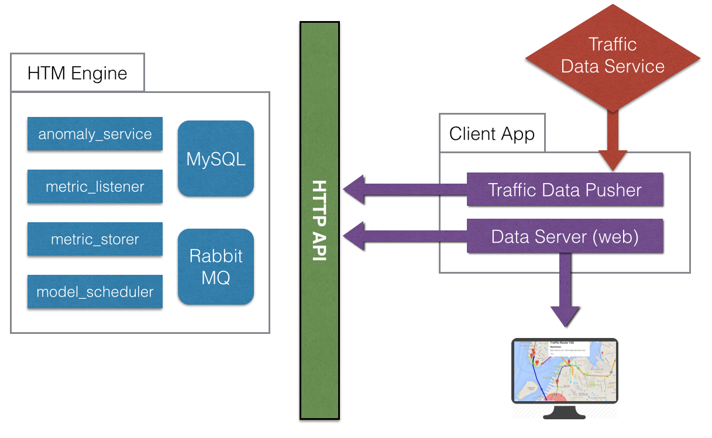

This application has two or more parts.

## 1. [HTM Engine Python Server](python-engine)

This server runs NuPIC within the [HTM Engine](https://github.com/numenta/numenta-apps/tree/master/htmengine). You must follow those installation instructions before this will work. Then you should start the server with [supervisord](http://supervisord.org/) (see the [README](https://github.com/numenta/numenta-apps/tree/master/htmengine)).

## 2. [Node.js Client Application](node-client)

This fetches the data, controls the HTM Engine via HTTP, pipes in mountains of data, displays results in webapp.

## 3. [River View](http://data.numenta.org) Traffic Data Service

This application is using a data service called [River View](https://github.com/nupic-community/river-view), which is currently running at <http://data.numenta.org>. It provides temporal data within a 6-month window, which includes NYC traffic data.

* * *

# BUILD YOUR OWN

This project started with a fork of the [skeleton-htmengine-app](https://github.com/oxtopus/skeleton-htmengine-app). That project is a great place to start if you want to create your own HTM Engine instance. All you really need to change is the MySQL database name and RabbitMQ queue names.

* * *

# Requires:

- [supervisord](http://supervisord.org/)
- [HTM Engine](https://github.com/numenta/numenta-apps/tree/master/htmengine), which also needs:
  - [NTA Utils](https://github.com/numenta/numenta-apps/tree/master/nta.utils)
  - [MySQL](https://www.mysql.com/)
  - [RabbitMQ](https://www.rabbitmq.com/)
( just do it )
- [Node.js](https://nodejs.org) & [NPM](http://npmjs.org) (hopefully it came with it)

Also, if you want to view the map of all the traffic paths (at `http://localhost:8083/map`) you'll need a [Google Maps API key](https://developers.google.com/maps/).

    export GOOGLE_MAPS_API_KEY=<your key>

# Startup

## HTM Engine (Python)

Be sure to install requirements.

    pip install -r python-engine/requirements.txt

Start supervisord from the `python-engine` folder.

    cd python-engine
    supervisord -c conf/supervisord.conf

## HTM HTTP Server (Python)

Provides a simple `GET`/`POST`/`PUT` HTTP interface on top of the HTM Engine.

    cd python-engine
    python webapp.py

This will run at <http://localhost:8080>.

## HTM Client (JavaScript)

    cd node-client
    npm install .
    npm start

This will run at <http://localhost:8083>. You only need to run `npm install` once.

* * *

# Runtime

Immediately after startup, the Node.js client application will start pulling traffic data from [River View](http://data.numenta.org/nyc-traffic/keys.json?includeDetails=1) and pushing it into the HTM Engine. A model is created for every traffic route available. For example, [traffic path "1"](http://data.numenta.org/nyc-traffic/1/meta.html) contains [traffic data](http://data.numenta.org/nyc-traffic/1/data.html) for __"11th ave n ganservoort - 12th ave @ 40th st"__ in Manhattan. This correlates to an HTM Engine model named "1". You can see the raw data for this model by querying the Python HTM Engine HTTP wrapper at <http://localhost:8080/1>. You should see a bunch of text data in the response.

# UI

There are lots of Dygraphs and Google Maps.
